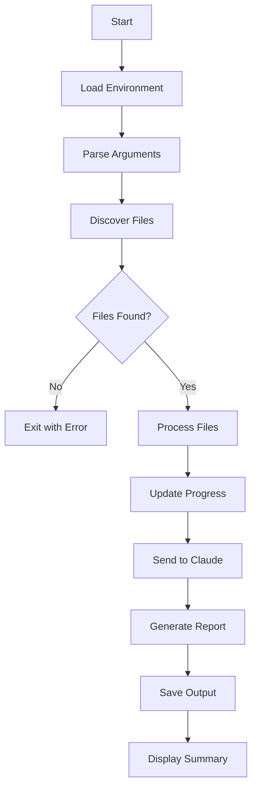

<!--
This documentation was auto-generated by Claude on 2025-05-31T17-01-42.
Source file: ./tools/claude_folder_review.py
-->

# Code Review Tool Documentation

## Overview

A Python script that automatically reviews code folders using Claude AI to provide insights on code organization, architecture, and potential improvements.

**Author:** André Wolke  
**Version:** 1.0.0  
**Date:** 2025-05-31

## Features

- **Multi-language Support**: Reviews Python, JavaScript, TypeScript, JSX, and TSX files
- **Progress Tracking**: Real-time progress bar with ETA estimation
- **Batch Processing**: Processes entire folders recursively
- **Markdown Output**: Generates structured review reports
- **Error Handling**: Graceful handling of file read errors and API failures

## Prerequisites

### Dependencies

```bash
pip install anthropic python-dotenv
```

### Environment Setup

Create a `.env` file in the project root:

```env
ANTHROPIC_API_KEY=your_claude_api_key_here
ANTHROPIC_MODEL=claude-sonnet-4-20250514
```

### Required Environment Variables

| Variable | Description | Default | Required |
|----------|-------------|---------|----------|
| `ANTHROPIC_API_KEY` | Claude API authentication key | None | ✅ Yes |
| `ANTHROPIC_MODEL` | Claude model version to use | `claude-sonnet-4-20250514` | ❌ No |

## Usage

### Basic Usage

```bash
python code_reviewer.py [folder_path]
```

### Examples

```bash
# Review default folder
python code_reviewer.py

# Review specific folder
python code_reviewer.py /path/to/your/project

# Review current directory
python code_reviewer.py .
```

## Configuration

### Supported File Extensions

Currently supports:
- `.py` (Python)
- `.js` (JavaScript)
- `.ts` (TypeScript)
- `.tsx` (TypeScript JSX)
- `.jsx` (JavaScript JSX)

### Extending File Support

To add more file types, modify the `valid_exts` tuple:

```python
valid_exts = (".py", ".js", ".ts", ".tsx", ".jsx", ".html", ".css", ".json", ".go", ".java", ".yaml", ".yml")
```

## Output

### File Structure

```
project/
├── output/
│   └── folder_review_2025-05-31T14-30-45.md
├── code_reviewer.py
└── .env
```

### Review Report Contents

The generated Markdown report includes:

- **Code Organization Analysis**
- **Bug Pattern Detection**
- **Architecture Weakness Assessment**
- **Modularization Suggestions**
- **Code Clarity Recommendations**

## Functions

### `render_progress(current, total, width=30)`

Generates a visual progress bar for file processing.

**Parameters:**
- `current` (int): Current progress count
- `total` (int): Total items to process
- `width` (int): Character width of progress bar (default: 30)

**Returns:**
- `str`: Formatted progress bar string

**Example Output:**
```
[████████████████████----------] 67%
```

## Error Handling

### Common Error Scenarios

| Error Type | Cause | Resolution |
|------------|-------|------------|
| No valid files found | Empty folder or no matching extensions | Check folder path and file extensions |
| File read error | Permission issues or corrupted files | Verify file permissions |
| Claude API error | Invalid API key or network issues | Check API key and internet connection |

### Exit Codes

- `0`: Successful execution
- `1`: No valid files found in target folder

## Performance

### Processing Metrics

The script provides real-time feedback including:
- Progress percentage
- Estimated time to completion (ETA)
- File processing confirmation
- Total execution time

### API Limits

- **Max Tokens**: 2000 per request
- **Model**: Configurable via environment variable
- **Rate Limiting**: Handled by Anthropic client

## File Processing Flow



## Troubleshooting

### Common Issues

**Issue:** `ModuleNotFoundError: No module named 'anthropic'`
**Solution:** Install required dependencies with `pip install anthropic python-dotenv`

**Issue:** `❌ No valid files found`
**Solution:** Verify the folder path contains files with supported extensions

**Issue:** `Claude API error: Authentication failed`
**Solution:** Check your `ANTHROPIC_API_KEY` in the `.env` file

### Debug Mode

For additional debugging information, you can modify the script to include verbose logging by adding print statements or using Python's logging module.

## Security Considerations

- Store API keys in `.env` files, never in source code
- Add `.env` to your `.gitignore` file
- Ensure proper file permissions for sensitive directories
- Review API usage to avoid unexpected charges

## License

This tool is provided as-is for code review purposes. Ensure compliance with your organization's code review and AI usage policies.