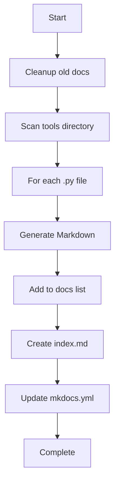

<!-- Auto-generated by Claude on 2025-05-31 21:34 -->

# Python Documentation Generator

## Overview

This Python script is an **automated documentation generator** that scans Python files in a source directory and creates Markdown documentation files. It's designed to work with MkDocs documentation sites and automatically updates both the documentation index and MkDocs configuration file.

## Purpose

- **Automate documentation creation** for Python tools and scripts
- **Generate Markdown files** containing the full source code of Python files
- **Maintain an organized documentation portal** with automatic indexing
- **Integrate seamlessly with MkDocs** for static site generation

## Configuration Constants

```python
SOURCE_DIR = "tools"          # Directory to scan for Python files
OUTPUT_DIR = "docs"           # Where generated documentation is saved
INDEX_FILE = "docs/index.md"  # Main documentation index file
MKDOCS_FILE = "mkdocs.yml"    # MkDocs configuration file
```

## Key Functions

### `normalize_filename(py_path: str) -> str`
Converts Python file paths to documentation-friendly filenames.

- **Input**: `"tools/changelog.py"`
- **Output**: `"tools_changelog.md"`
- **Purpose**: Creates consistent naming for generated documentation files

### `extract_title(py_path: str) -> str`
Generates human-readable titles from Python file paths.

- **Removes** file extensions and underscores
- **Capitalizes** words for presentation
- **Example**: `"data_processor.py"` → `"Data Processor"`

### `generate_markdown(py_path: str, output_path: str)`
Creates the actual Markdown documentation files.

**Features:**
- Adds file path as main heading
- Includes last modification timestamp
- Wraps entire Python source code in code blocks
- Preserves original formatting and syntax

### `cleanup_old_docs()`
Removes previously generated documentation files to prevent accumulation of outdated files.

**Targets files matching:**
- `autodoc_tools_*.md`
- `tools_*.md`

### `main()` - Primary Workflow
Orchestrates the entire documentation generation process:

1. **Cleanup** old documentation files
2. **Scan** source directory for Python files
3. **Generate** Markdown documentation for each file
4. **Create** documentation index with links
5. **Update** MkDocs navigation configuration

## Workflow Process



## Generated Output Structure

### Documentation Files
- **Location**: `docs/` directory
- **Format**: `tools_filename.md`
- **Content**: Full source code with metadata

### Index File (`docs/index.md`)
```markdown
# 📚 Auto-Generated Documentation Index

Welcome to the Nautee documentation portal. These are the current tools:

- [Tool Name](tools_toolname.md)
- [Another Tool](tools_anothertool.md)
```

### MkDocs Configuration
Automatically updates the `nav` section in `mkdocs.yml`:
```yaml
nav:
  - Home: index.md
  - AutoDocs:
      - Tool Name: tools_toolname.md
      - Another Tool: tools_anothertool.md
```

## Usage

Run the script directly:
```bash
python documentation_generator.py
```

## Requirements & Dependencies

- **Python 3.6+**
- **Standard library only** (no external dependencies)
- **File system access** to source and documentation directories
- **MkDocs project structure** (optional, for full integration)

## Notes & Suggestions

### ✅ Strengths
- **Zero external dependencies**
- **Automatic cleanup** prevents file accumulation
- **Seamless MkDocs integration**
- **Preserves file timestamps** for tracking changes

### ⚠️ Considerations
- **Limited to Python files only** (excludes `__init__.py` and similar)
- **Simple code block output** - no syntax highlighting configuration
- **Overwrites existing documentation** without version control
- **MkDocs YAML parsing** is basic and may not handle complex configurations

### 🔧 Potential Improvements
- Add support for **docstring extraction** and formatting
- Implement **incremental updates** (only regenerate changed files)
- Add **configuration file support** for custom settings
- Include **file size and line count** statistics
- Add **error handling** for file access issues
- Support **multiple source directories**

### 🎯 Best Practices
- Run this script as part of a **CI/CD pipeline**
- **Commit generated files** to version control for deployment
- **Schedule regular runs** to keep documentation current
- **Review generated index** before publishing