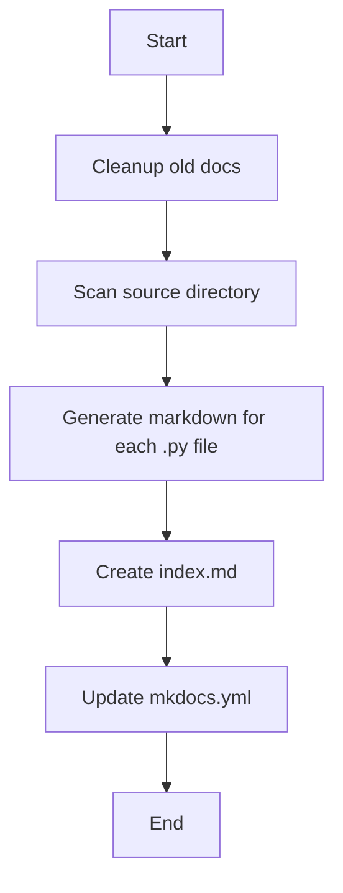

<!-- Auto-generated by Claude on 2025-05-31 20:31 -->

# Documentation Generator

## Overview

This Python script is an **automatic documentation generator** that processes Python files in a source directory and creates Markdown documentation files. It's designed to work with MkDocs to generate a documentation website for Python tools and scripts.

## Purpose

The script serves to:
- Automatically generate Markdown documentation from Python source files
- Create an index page listing all documented tools
- Update MkDocs configuration to include the generated documentation
- Maintain up-to-date documentation with file modification timestamps

## Configuration Constants

```python
SOURCE_DIR = "tools"        # Directory containing Python files to document
OUTPUT_DIR = "docs"         # Directory where Markdown files are generated
INDEX_FILE = "docs/index.md" # Main index file path
MKDOCS_FILE = "mkdocs.yml"  # MkDocs configuration file
```

## Key Functions

### `normalize_filename(py_path: str) -> str`
- **Purpose**: Converts Python file paths to valid Markdown filenames
- **Example**: `tools/changelog.py` → `tools_changelog.md`
- **Implementation**: Replaces path separators and file extensions

### `extract_title(py_path: str) -> str`
- **Purpose**: Creates human-readable titles from file paths
- **Example**: `tools/data_processor.py` → `Data Processor`
- **Implementation**: Removes file extension, replaces underscores with spaces, applies title case

### `generate_markdown(py_path: str, output_path: str)`
- **Purpose**: Creates Markdown documentation files containing the Python source code
- **Features**:
  - Adds file path as header
  - Includes last modification timestamp
  - Wraps entire Python file content in code blocks
- **Output Format**:
  ```markdown
  # `tools/example.py`
  
  _Last updated: 2024-01-15 14:30_
  
  ```python
  # Python code content here
  ```
  ```

### `cleanup_old_docs()`
- **Purpose**: Removes previously generated documentation files
- **Targets**: Files matching patterns `autodoc_tools_*.md` and `tools_*.md`
- **Benefit**: Prevents accumulation of outdated documentation

### `main()`
The primary orchestration function that:
1. Cleans up old documentation files
2. Walks through the source directory to find Python files
3. Generates Markdown documentation for each file
4. Creates an index page with links to all documentation
5. Updates the MkDocs configuration file

## Workflow



## Usage

Run the script directly:
```bash
python generate_docs.py
```

## File Processing Rules

- **Included**: All `.py` files in the source directory and subdirectories
- **Excluded**: Files starting with `__` (like `__init__.py`, `__pycache__`)
- **Recursive**: Processes files in subdirectories

## Generated Output

### Index File (`docs/index.md`)
Creates a welcome page with links to all documented tools:
```markdown
# 📚 Auto-Generated Documentation Index

Welcome to the Nautee documentation portal. These are the current tools:

- [Changelog](tools_changelog.md)
- [Data Processor](tools_data_processor.md)
```

### MkDocs Configuration
Updates the navigation section in `mkdocs.yml`:
```yaml
nav:
  - Home: index.md
  - AutoDocs:
      - Changelog: tools_changelog.md
      - Data Processor: tools_data_processor.md
```

## Notes and Suggestions

### ⚠️ Considerations
- The script overwrites the entire `nav` section in MkDocs configuration
- Large Python files will generate large documentation pages
- No syntax highlighting configuration is specified

### 🔧 Potential Improvements
- Add docstring extraction for better documentation
- Include file size limits to prevent oversized documentation
- Add error handling for file I/O operations
- Support for excluding specific files or directories
- Generate table of contents for individual files
- Add support for custom documentation templates

### 📋 Dependencies
- **Standard Library Only**: Uses only built-in Python modules
- **External Requirements**: Expects MkDocs project structure
- **File System**: Requires write permissions to docs directory