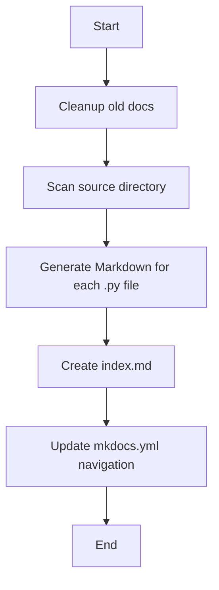

<!-- Auto-generated by Claude on 2025-05-31 21:12 -->

# Auto-Documentation Generator

This Python script is an automated documentation generator that creates Markdown documentation from Python source files and integrates with MkDocs for website generation.

## Purpose

The script serves as a documentation automation tool that:
- Scans Python files in a source directory
- Generates Markdown documentation files containing the source code
- Creates an index page linking to all generated documentation
- Updates MkDocs configuration to include the new documentation pages

## Configuration Constants

```python
SOURCE_DIR = "tools"          # Directory to scan for Python files
OUTPUT_DIR = "docs"           # Directory where documentation is generated
INDEX_FILE = "docs/index.md"  # Main index file path
MKDOCS_FILE = "mkdocs.yml"    # MkDocs configuration file
```

## Key Functions

### `normalize_filename(py_path: str) -> str`
Converts Python file paths to documentation-friendly filenames.

- **Input**: `"tools/changelog.py"`
- **Output**: `"tools_changelog.md"`
- Replaces directory separators with underscores
- Changes `.py` extension to `.md`

### `extract_title(py_path: str) -> str`
Generates human-readable titles from file paths.

- Extracts the base filename
- Removes `.py` extension
- Converts underscores to spaces
- Applies title case formatting

### `generate_markdown(py_path: str, output_path: str)`
Creates Markdown documentation files containing:

- **File header** with the original Python file path
- **Last modified timestamp** for tracking updates
- **Complete source code** wrapped in Python code blocks

**Example output:**
```markdown
# `tools/example.py`

_Last updated: 2024-01-15 14:30_

```python
# Python source code here...
```

### `cleanup_old_docs()`
Removes previously generated documentation files to prevent accumulation of outdated docs.

- Cleans files matching patterns: `autodoc_tools_*.md` and `tools_*.md`
- Ensures fresh documentation generation on each run

### `main()`
Main execution function that orchestrates the documentation generation process:

1. **Cleanup**: Removes old documentation files
2. **Scan**: Walks through the source directory for Python files
3. **Generate**: Creates Markdown files for each Python file
4. **Index**: Creates a comprehensive index page with links
5. **Configure**: Updates MkDocs navigation structure

## Workflow



## File Filtering

The script processes Python files with these criteria:
- ✅ Files ending with `.py`
- ❌ Files starting with `__` (e.g., `__init__.py`, `__pycache__`)

## MkDocs Integration

The script automatically updates the `mkdocs.yml` file with a navigation structure:

```yaml
nav:
  - Home: index.md
  - AutoDocs:
      - Changelog: tools_changelog.md
      - Utilities: tools_utilities.md
```

## Usage

Run the script directly:

```bash
python autodoc_generator.py
```

## Notes and Suggestions

### ⚠️ Important Considerations

- **Backup your `mkdocs.yml`**: The script overwrites the navigation section
- **File encoding**: Assumes UTF-8 encoding for all files
- **Directory structure**: Requires `docs/` directory to exist

### 🔧 Potential Improvements

1. **Error handling**: Add try-catch blocks for file operations
2. **Configuration file**: Move constants to a separate config file
3. **Docstring extraction**: Parse and display function/class docstrings separately
4. **Selective generation**: Add options to exclude specific files or directories
5. **Template system**: Allow customizable Markdown templates
6. **Backup functionality**: Create backups of `mkdocs.yml` before modification

### 💡 Usage Tips

- Run this script as part of your CI/CD pipeline for automatic documentation updates
- Consider scheduling regular runs to keep documentation current
- Use version control to track changes in generated documentation